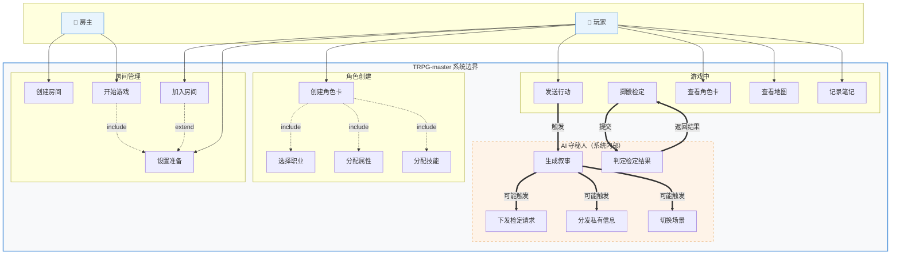
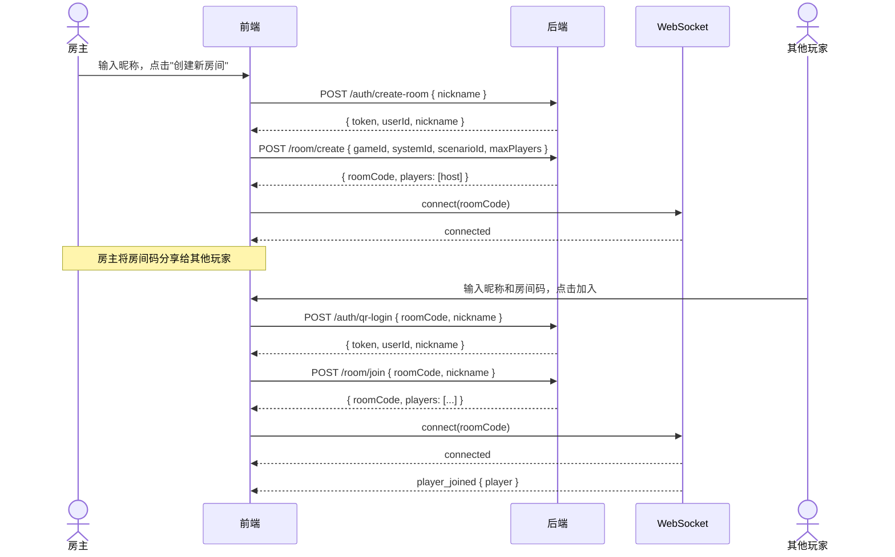
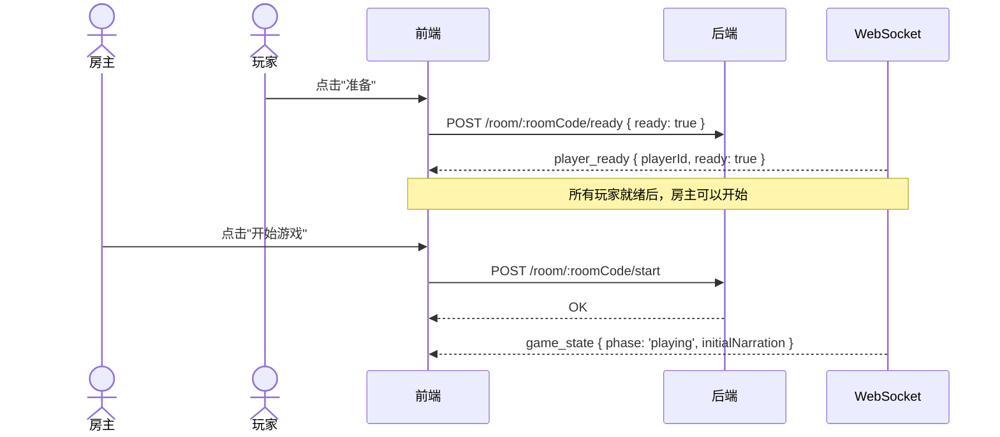
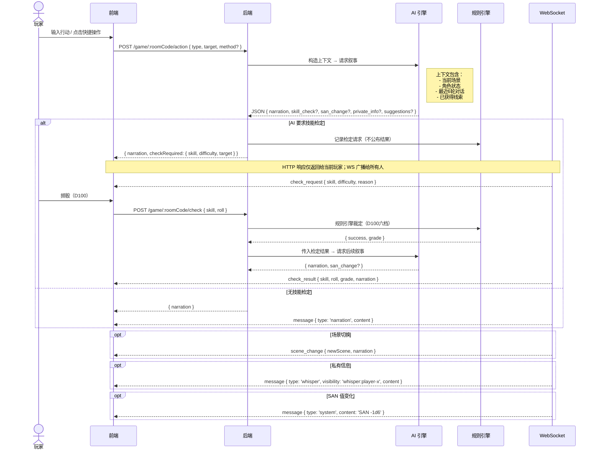

# TRPG-master API 契约文档

> 反向分析自前端项目 `trpg-app`（LMH-1-Folder 分支，2026-07-13 更新）
> 当前状态：Mock Mode（`VITE_MOCK_API=true`）

---

## 1. 用例图



<span style="background:#e8f4fd;padding:2px 8px;border:1px solid #4a90d9;border-radius:4px;font-size:13px">👤 房主 / 玩家</span>
<span style="background:#f8f9fa;padding:2px 8px;border:2px solid #4a90d9;border-radius:4px;font-size:13px;margin-left:12px">系统边界</span>
<span style="background:#fef3e8;padding:2px 8px;border:1px dashed #e8963e;border-radius:4px;font-size:13px;margin-left:12px">AI 守秘人（内部组件）</span>

**关键设计要点：**

| 关系 | 含义 |
|------|------|
| `房主` | 继承了玩家所有能力，额外拥有创建房间和开始游戏的权限 |
| `创建角色卡` include `选择职业 + 分配属性 + 分配技能` | 角色创建必须依次完成这三个步骤 |
| `开始游戏` include `全部准备` | 所有玩家就绪是游戏开始的前提 |
| `发送行动` → `AI 守秘人` | 玩家的每一次行动都触发 AI 生成叙事 |
| `掷骰检定` ↔ `AI 守秘人` | 玩家掷骰后由规则引擎裁定，AI 根据结果继续叙事 |
| AI 守秘人的虚线框 | AI 是系统内部组件，不是独立的外部 Actor |

---

## 2. 时序图

### 2.1 创建房间 & 加入房间



### 2.2 准备 & 开始游戏



### 2.3 游戏主循环（玩家行动 → AI 叙事 → 技能检定）



---

## 3. 环境配置

| 变量 | 默认值 | 说明 |
|------|--------|------|
| `VITE_MOCK_API` | `true` | 启用 Mock 模式（所有请求返回 `{}`） |
| `VITE_API_URL` | `http://localhost:3001/api` | 后端 API 地址 |
| `VITE_WS_URL` | `ws://localhost:3001/ws` | WebSocket 地址 |

---

## 4. 通用约定

### 请求头

```
Content-Type: application/json
Authorization: Bearer <token>
```

### 通用响应格式

```typescript
interface ApiResponse<T> {
  ok: boolean
  data: T
  error?: string
}
```

### HTTP 状态码

| 状态码 | 含义 |
|--------|------|
| 200 | 成功 |
| 400 | 请求参数错误 |
| 401 | 未授权（token 无效或过期） |
| 403 | 无权限操作 |
| 404 | 房间/资源不存在 |
| 500 | 服务器内部错误 |

---

## 5. 认证模块 `/auth`

### 5.1 QR 码登录 / 加入房间

```
POST /auth/qr-login
```

> 玩家通过扫描房间 QR 码加入已存在的房间

**Request Body:**

```typescript
interface LoginRequest {
  roomCode?: string   // 房间码，6位
  nickname?: string   // 玩家昵称
}
```

**Response:**

```typescript
ApiResponse<LoginResponse>
```

---

### 5.2 创建房间（同时认证）

```
POST /auth/create-room
```

> 房主创建新房间，同时完成认证

**Request Body:**

```typescript
{
  nickname: string
}
```

**Response:**

```typescript
ApiResponse<LoginResponse>
```

---

### 5.3 检查会话

```
GET /auth/session
```

> 验证当前 token 是否有效

**Response:** `200 OK` (有效) / `401` (无效)

---

## 6. 房间管理 `/room`

### 6.1 创建游戏房间

```
POST /room/create
```

**Request Body:**

```typescript
interface CreateRoomRequest {
  gameId: string        // 游戏类型: "trpg" | "blood-clock" | "werewolf" | "script-murder"
  systemId: string      // 规则系统: "coc" | "dnd"
  scenarioId?: string   // 模组 ID (可选)
  maxPlayers: number    // 最大玩家数 (推荐 3-5)
}
```

**Response:**

```typescript
interface RoomResponse {
  roomCode: string      // 6位房间码
  players: Player[]     // 当前玩家列表
}
```

---

### 6.2 加入房间

```
POST /room/join
```

**Request Body:**

```typescript
interface JoinRoomRequest {
  roomCode: string      // 房间码
  nickname: string      // 昵称
}
```

**Response:**

```typescript
ApiResponse<RoomResponse>
```

---

### 6.3 获取房间信息

```
GET /room/:roomCode
```

**Response:**

```typescript
ApiResponse<RoomResponse>
```

---

### 6.4 设置准备状态

```
POST /room/:roomCode/ready
```

**Request Body:**

```typescript
{
  ready: boolean
}
```

**Response:**

```typescript
ApiResponse<void>
```

---

### 6.5 离开房间

```
POST /room/:roomCode/leave
```

**Response:**

```typescript
ApiResponse<void>
```

---

### 6.6 开始游戏

```
POST /room/:roomCode/start
```

> 仅房主可调用，要求所有玩家已准备

**Response:**

```typescript
ApiResponse<void>
```

---

## 7. 游戏操作 `/game`

### 7.1 执行行动

```
POST /game/:roomCode/action
```

> 玩家执行一个游戏行动。AI 守秘人会据此生成叙事，可能触发技能检定。

**Request Body:**

```typescript
interface GameActionRequest {
  type: 'move' | 'search' | 'talk' | 'use' | 'attack' | 'observe'
  target: string        // 行动目标 (NPC名、物品名、方向等)
  method?: string       // 更详细的行动方式 (可选)
}
```

**Response:**

```typescript
interface GameActionResponse {
  narration: string     // AI 守秘人的叙事文本
  checkRequired?: {
    skill: string       // 需要检定的技能 ID
    difficulty: string  // 难度: "normal" | "hard" | "extreme"
    target: number      // 目标值 (通常为技能值的 1/2 或 1/5)
  }
  sceneTransition?: string  // 场景切换描述/新场景 ID
}
```

---

### 7.2 提交技能检定结果

```
POST /game/:roomCode/check
```

> 玩家掷骰后将结果提交给后端，由规则引擎裁定。

**Request Body:**

```typescript
interface CheckResultRequest {
  skill: string         // 检定的技能 ID
  roll: number          // D100 掷骰结果 (1-100)
}
```

**Response:**

```typescript
interface CheckResultResponse {
  success: boolean
  grade: 'critical' | 'hard' | 'normal' | 'fail' | 'fumble'
  narration: string     // AI 根据检定结果生成的叙事
}
```

### D100 检定五档对照表

> 注：CoC 7e 标准规则为 6 档（含"极限成功 Extreme"），当前前端类型定义仅 5 档，后续应补齐。

| 等级 | 英文 | 判定条件 | 示例 (技能值 50) |
|------|------|----------|-----------------|
| 大成功 | Critical | roll ≤ 1 | 1 |
| 困难成功 | Hard | roll ≤ skill/2 | 1-25 |
| 普通成功 | Normal | roll ≤ skill | 1-50 |
| 失败 | Failure | roll > skill | 51-99 |
| 大失败 | Fumble | roll = 100 | 100 |

---

### 7.3 获取游戏状态

```
GET /game/:roomCode/state
```

**Response:**

```typescript
ApiResponse<{
  token: string       // JWT 令牌
  userId: string      // 用户 ID
  nickname: string    // 昵称
}>
```

---

### 7.4 获取可用行动

```
GET /game/:roomCode/actions
```

> 根据当前场景返回可用行动列表

**Response:**

```typescript
ApiResponse<{
  token: string       // JWT 令牌
  userId: string      // 用户 ID
  nickname: string    // 昵称
}>
```

---

### 7.5 获取游戏历史

```
GET /game/:roomCode/history?since=timestamp
```

> 获取游戏消息历史，支持增量拉取

**Response:**

```typescript
ApiResponse<unknown[]>   // TODO: 定义 GameMessage 类型
```

---

> **待补充：角色卡 CRUD API** — 前端 CharacterPage 有完整的角色创建流程（4 步向导），但 services 层目前没有对应的 `POST /character/save` 等接口，后端设计时需补充角色的创建、查询、更新端点。

## 8. WebSocket 事件

### 连接

```
ws://localhost:3001/ws/:roomCode
```

在客户端调用 `connectWebSocket(roomCode)` 建立连接。

### 8.1 客户端 → 服务端

> 以下事件类型为推断（源码 `sendWsMessage(type: string)` 无类型约束）

```typescript
function sendWsMessage(type: string, payload: unknown): void
```

| 事件类型 | 触发时机 | Payload |
|----------|----------|---------|
| `message` | 发送聊天消息 | `{ content: string }` |
| `action` | 执行游戏行动 | `GameActionRequest` |
| `check_result` | 提交检定结果 | `CheckResultRequest` |
| `ready` | 切换准备状态 | `{ ready: boolean }` |

### 8.2 服务端 → 客户端

```typescript
interface WsEvent {
  type: WsEventType
  payload: unknown
  timestamp: string   // ISO 8601
}

type WsEventType =
  | 'message'          // 聊天/叙事消息 → GameMessage
  | 'player_joined'    // 新玩家加入 → Player
  | 'player_left'      // 玩家离开 → { playerId: string }
  | 'player_ready'     // 玩家切换准备状态 → { playerId, ready }
  | 'game_state'       // 完整游戏状态同步
  | 'check_request'    // KP 要求技能检定 → { skill, difficulty, target, reason }
  | 'check_result'     // 检定结果广播 → CheckResultResponse
  | 'scene_change'     // 场景切换 → { newSceneId, narration }
```

---

## 9. 核心数据模型

### 9.1 玩家

```typescript
interface Player {
  id: string               // 玩家 ID
  nickname: string         // 昵称
  characterName: string | null  // 角色名称
  isReady: boolean         // 是否已准备
  isHost: boolean          // 是否为房主
  isAi: boolean            // 是否为 AI 填充玩家
}
```

### 9.2 游戏消息

```typescript
type MessageType = 'narration' | 'npc_dialogue' | 'player_speech'
                 | 'player_action' | 'skill_check' | 'system' | 'whisper'

type Visibility = 'public' | `whisper:${string}` | 'gm_only'

interface CheckResult {
  skill: string            // 技能 ID
  roll: number             // 掷骰结果
  target: number           // 目标值
  grade: string            // 'critical' | 'hard' | 'normal' | 'fail' | 'fumble'
}

interface GameMessage {
  id: string
  type: MessageType
  content: string
  sender: 'ai_kp' | `player:${string}`
  visibility: Visibility
  timestamp: string
  metadata?: {
    checkResult?: CheckResult
    sceneTransition?: string
    promptActions?: string[]
  }
}
```

### 9.3 调查员（角色卡）

```typescript
interface InvestigatorInfo {
  name: string
  playerName: string
  age: number
  gender: string
  residence: string
  birthplace: string
  occupationId: number | null
}

interface Attributes {
  str: number   // 力量
  con: number   // 体质
  pow: number   // 意志
  dex: number   // 敏捷
  app: number   // 外貌
  siz: number   // 体型
  int: number   // 智力
  edu: number   // 教育
}
```

**派生属性：**

| 属性 | 计算公式 | 范围 |
|------|----------|------|
| HP (生命值) | `(CON + SIZ) / 10` | - |
| SAN (理智值) | `POW` | 0-99 |
| MP (魔法值) | `POW / 5` | - |
| DB (伤害加值) | 基于 STR+SIZ 查表 | - |
| MOV (移动力) | 基于 STR+SIZ+DEX 计算 | - |
| LUCK (幸运) | `3D6 * 5` | 15-90 |

### 9.4 完整角色卡

```typescript
interface CompletedCharacter {
  info: InvestigatorInfo        // 基本信息
  attr: Attributes              // 属性值
  skillAlloc: Record<string, number>  // 技能分配 { "spot-hidden": 65, ... }
  equipment: string             // 装备描述
  background: string            // 背景故事
  notes: string                 // 笔记
  derived: {
    hp: number                  // 生命值
    san: number                 // 理智值
    mp: number                  // 魔法值
    db: string                  // 伤害加值
    move: number                // 移动力
  }
}
```

由 `useCharacterStore` 管理，角色创建完成后存入。当前纯前端持有，尚未对接 `POST /character/save` 接口。

### 9.5 技能与职业

```typescript
interface SkillDefinition {
  id: string               // "spot-hidden", "library-use", etc.
  name: string             // 中文名
  nameEn: string           // 英文名
  base: number             // 基础值 (1-99)
  category: 'combat' | 'social' | 'knowledge' | 'perception'
           | 'physical' | 'technical' | 'language'
  relatedAttr?: string     // 关联属性 (如 "edu")
}

interface OccupationDefinition {
  id: number
  name: string             // 职业名
  creditRange: string      // 信用评级范围 (如 "9-30")
  skillPoints: string      // 技能点公式 (如 "EDU×4")
  icon: string             // 表情图标
  skillIds: string[]       // 职业技能 ID 列表
  shortDesc: string        // 简述
}
```

---

## 10. 游戏配置注册表

### 10.1 游戏类型

| ID | 名称 | 状态 |
|----|------|------|
| `trpg` | 跑团 | `recommended` (可用) |
| `blood-clock` | 血染钟楼 | `coming-soon` |
| `werewolf` | 狼人杀 | `coming-soon` |
| `script-murder` | 剧本杀 | `coming-soon` |

### 10.2 规则系统（TRPG 下）

| ID | 名称 | 状态 |
|----|------|------|
| `coc` | 克苏鲁的呼唤 7th | `ready` |
| `dnd` | 龙与地下城 5e | `wip` |

### 10.3 CoC 7th 模组

| ID | 名称 | 难度 | 人数 | 时长 |
|----|------|------|------|------|
| `whateley` | 惠特利旧宅 | 入门 | 2-4 | 3-4h |
| `dark-edge` | 暗黑边缘 | 进阶 | 3-5 | 6-8h |
| `dead-light` | 死光 | 入门 | 2-4 | 2-3h |
| `book-hunter` | 追书人 | 入门 | 1-2 | 2-3h |

---

## 11. 附录：当前 Mock 实现说明

当前前端 `VITE_MOCK_API=true`，所有 API 调用行为如下：

| API 层 | 行为 |
|--------|------|
| `apiRequest()` | 直接返回 `{} as T`，不发 HTTP 请求 |
| WebSocket | 仅日志输出，不建立连接 |
| 登录 | 无真实认证，任意点击直接进入 |
| 骰子 | 客户端 `Math.random()` 模拟 |
| AI 叙事 | 前端 `setTimeout` 模拟 2-4s 延迟后返回固定文本 |
| 职业数据 | 运行时从 `public/data/occupations.xlsx` 加载（SheetJS） |

切换到真实后端：将 `.env` 中 `VITE_MOCK_API=false`，并确保后端运行在 `http://localhost:3001`。
