# 产品设计方法论

> 本文档是通用方法论参考，不与任何具体项目绑定。
>
> **核心思想**：产品设计的本质，是在不确定性和约束下，通过持续决策创造用户价值。工具服务于决策，而非服务于流程。

---

## 目录

1. [核心原则](#一核心原则)
2. [产品设计四层模型](#二产品设计四层模型)
3. [设计思维与双钻模型](#三设计思维与双钻模型)
4. [持续发现与 OST](#四持续发现与-ost)
5. [JTBD：用户任务分析](#五jtbd用户任务分析)
6. [用户研究工具](#六用户研究工具)
7. [指标设计](#七指标设计)
8. [需求优先级排序](#八需求优先级排序)
9. [PRD 与 Proposal](#九prd-与-proposal)
10. [验证与实验](#十验证与实验)
11. [决策与评审机制](#十一决策与评审机制)
12. [AI 产品设计](#十二ai-产品设计)
13. [反模式：十大失败模式](#十三反模式十大失败模式)
14. [方法选择指南](#十四方法选择指南)

---

## 一、核心原则

> 产品设计的方法可以千变万化，但以下原则是不变量。方法随项目类型增减，原则不变。

### 1.1 产品设计是决策，不是功能清单

每一个设计点都必须回答三个问题：

- **有哪些可选方案？**
- **选择哪一个？**
- **为什么？**（用户价值、成本、风险、本期边界）

只罗列功能而不呈现决策过程的文档，不具备可评审性。

### 1.2 问题先行，方案后行


跳过了问题定义直接进入方案讨论，是最常见的产品设计失败模式。

### 1.3 文本先于原型，原型先于代码

细化设计的顺序不可颠倒：

```
文字描述（明确决策：要什么、不要什么、边界在哪）
    → 原型（在文字定稿基础上将交互具象化）
        → 代码（基于定稿的规格实现）
```

无界面的产品（SDK、CLI、API）仅需第一步。

### 1.4 减法设计

> "Perfection is achieved not when there is nothing more to add, but when there is nothing left to take away." — Antoine de Saint-Exupéry

**每一个功能都必须经受拷问**："在 MVP 中移除它，核心任务闭环是否仍能完成？如果能，它就是冗余。"

**明确列出「本期不做」与列出「本期要做」同等重要。**

### 1.5 设计文档定稿即只读

设计文档进入开发后视为定稿，不可回头修改。需求调整时**新写一份描述变化**（变更内容、原因、影响范围），不覆盖旧文档。这样整个决策链条可追溯。

> 只读不代表需求不能变——而是变更必须走正式流程、全程留痕、同步所有相关方。

### 1.6 场景绑定

所有设计决策都必须绑定具体用户场景。脱离场景的功能讨论无意义——"加一个导出按钮"不是需求，"用户在周会上需要快速把图表贴到 PPT 里"才是。

---

## 二、产品设计四层模型

> 许多产品失败的原因不是方案做得不好，而是从一开始就跳到了错误的层次。

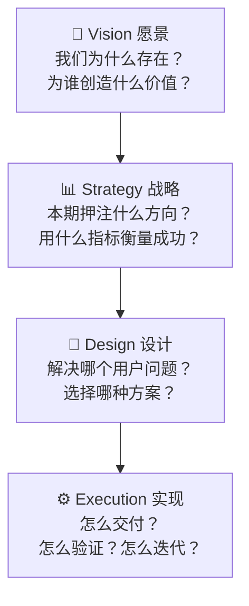

| 层 | 回答的问题 | 典型产出 | 决策者 |
|----|-----------|---------|--------|
| **Vision** | 为谁、创造什么价值？为什么是我们？ | 产品愿景宣言、长期路线图 | 创始团队 / 产品负责人 |
| **Strategy** | 本期押注什么？用什么指标衡量成败？ | OKR、产品策略文档、竞品定位 | PM + 业务负责人 |
| **Design** | 解决哪个用户问题？选哪个方案？不做哪些？ | PRD、Proposal、原型 | Product Trio |
| **Execution** | 怎么做出来？怎么验证效果？ | 开发计划、实验方案、上线复盘 | 全团队 |

**应用规则**：

- 在开始 Design 之前，确认 Strategy 层的本期方向是清楚的。
- 如果 Strategy 层不清晰，不要强行做 Design——先向上对齐。
- 一次设计迭代只在一个层内操作。跨层变更（如战略调整）必须显式沟通。

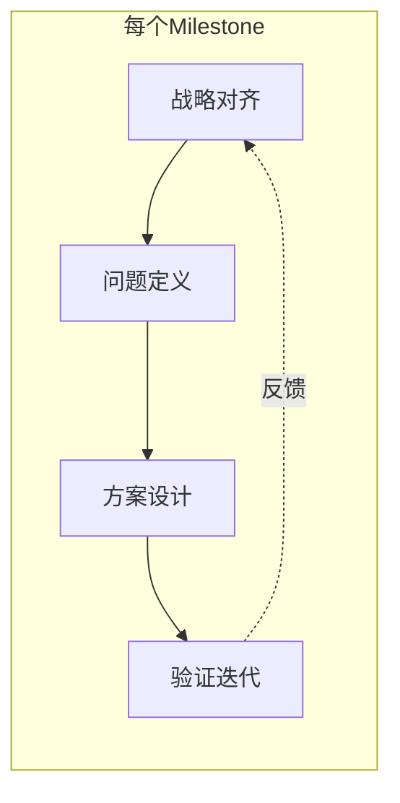

---

## 三、设计思维与双钻模型

### 3.1 双钻模型

由英国设计委员会提出，核心思想是**两轮发散与收敛**。注意：实际项目中四个阶段常在微周期内迭代（一个 Sprint 内走完一轮微缩双钻），而非一次线性走完。

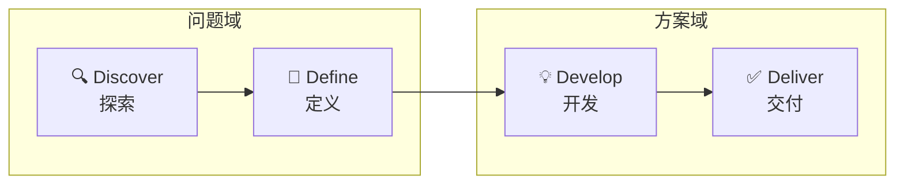

#### Discover：发散问题空间

**目标**：不做判断地收集信息，让问题全貌自然浮现。

- 用户访谈与观察（最少 5 人，每类用户）
- 竞品调研（功能矩阵、定位地图、优劣势）
- 数据分析（漏斗、留存、客服工单）
- 利益相关者访谈

#### Define：收敛问题空间

**目标**：提炼出团队共识的问题定义——这是后续所有设计的锚点。

- Persona（行为聚合，非人口统计）
- Journey Map（区分 As-Is 现状和 To-Be 未来）
- 竞品分析框架（功能对比矩阵 / 定位地图 / SWOT）
- Problem Statement + 成功指标初稿

#### Develop：发散方案空间

**目标**：每个机会至少产出 3 个候选方案（单一方案 = 确认偏误）。

- 头脑风暴 + SCAMPER 创意法
- 竞品方案参考（不复制，理解取舍）
- 低保真原型

#### Deliver：收敛方案空间

**目标**：选出最优方案，完成细节，准备交付。

- 方案评估（对照成功指标和约束条件）
- 高保真原型 + 可用性测试（5±2 人法则）
- 定稿为 PRD / Proposal

### 3.2 双钻与 OST 的关系

这是一个经常被混淆的点：

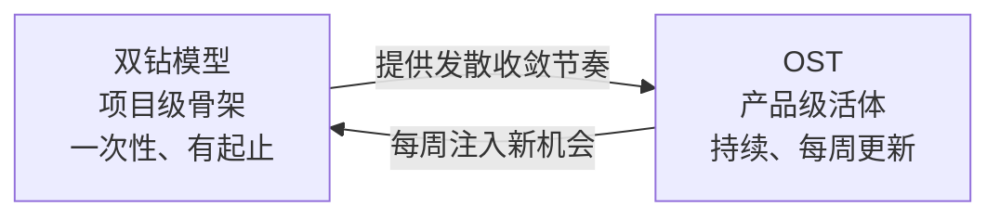

- **双钻**是"项目级"骨架——每次需求启动时用它定方向，有明确的起止。
- **OST** 是"产品级"活体——持续维护，每周根据用户接触更新。
- 0→1 阶段双钻定锚点，1→N 阶段 OST 持续喂养。

### 3.3 设计思维五步法

IDEO / Stanford d.school 的经典流程，与双钻互补：

| 步骤 | 英文 | 核心活动 | 对应双钻阶段 |
|------|------|---------|------------|
| 共情 | Empathize | 观察、访谈、沉浸式体验用户情境 | Discover |
| 定义 | Define | 提炼洞察，形成可操作的问题陈述 | Define |
| 构想 | Ideate | 突破惯性思维，大量产出想法 | Develop |
| 原型 | Prototype | 快速、低成本做出可测试的原型 | Develop → Deliver |
| 测试 | Test | 让真实用户使用，收集反馈，迭代改进 | Deliver |

---

## 四、持续发现与 OST

### 4.1 为什么要持续发现

传统瀑布假设"需求可以一次性搞清楚"。在不确定性强的领域（尤其是 AI 产品），这个假设不成立。

Teresa Torres 的核心主张：

> 产品 trio（PM + 设计师 + 工程师）每周至少接触一次真实用户，围绕一个产出指标持续做小规模研究活动。

**如果 trio 无法全时参与**，最小落地版：工程师至少参加用户访谈，设计师至少参加优先级讨论。

### 4.2 机会解决方案树（OST）

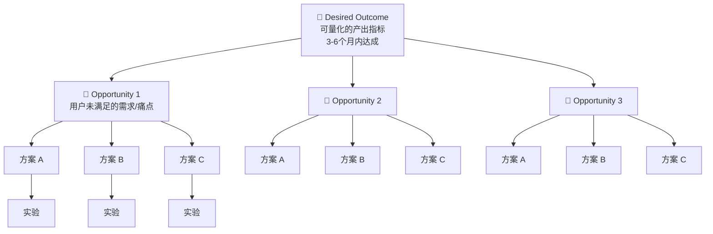

#### 四层含义（含常见混淆）

| 层 | ✅ 是什么 | ❌ 不是什么 |
|----|----------|-----------|
| **产出** | 可量化的用户行为变化 | 功能列表、交付物 |
| **机会** | 用户未满足的需求、痛点 | 方案或功能 |
| **方案** | 解决某个机会的具体手段 | 只有一种方案（必须 ≥ 3） |
| **实验** | 验证假设的最小代价行动 | 完整开发 |

**常见错误**：把"做一个自然语言转 PromQL 的功能"当机会——这是方案。真正的机会是"用户不会写 PromQL，但又需要快速查指标"。

#### 核心规则

1. **从产出开始，不从方案开始**——先定义成功标准。
2. **每个机会 ≥ 3 个方案**——只有一个 = 没想清楚。
3. **双向箭头**——方案验证的结果会反过来修正你对机会的理解。
4. **树是活的**——每周更新。不更新的 OST 是 dead document。
5. **子机会拆分**——当某个机会过大时下钻为子机会树。
6. **跨树去重**——多个 Outcome 树出现重复机会时合并。

### 4.3 五个习惯

1. **每周用户接触** — trio 每周至少访谈 1 个用户
2. **绘制机会地图** — 用 OST 可视化机会空间
3. **显式化假设** — 在动手前把隐藏信念写出来，按"影响程度 × 不确定性"排序
4. **小规模实验** — 先测试风险最大的假设，后测试确定性高的
5. **trio 共同参与** — PM、设计师、工程师一起发现，不分工

---

## 五、JTBD：用户任务分析

### 5.1 核心概念

JTBD（Jobs to be Done）由 Clayton Christensen 提出。核心问题：

> **用户在什么情境下，为了达成什么目的，"雇佣"你的产品？**

| | 传统需求分析 | JTBD |
|----|-----------|------|
| 关心什么 | 用户是谁（人口统计） | 用户在什么情境下想完成什么任务 |
| 分析单元 | 用户画像 → 功能需求 | 任务情境 → 雇用/解雇标准 |
| 竞争视野 | 同类产品 | 任何能完成这个任务的手段 |

### 5.2 任务故事格式（JTBD 标准书写）

```
当 [情境] 时，
我想要 [动机]，
以便 [预期结果]。
```

示例：

> 当凌晨 2 点被告警电话叫醒、时间紧迫时，我想要立即看到异常服务的 CPU 趋势图和关联信息，以便在 1 分钟内判断是否需要升级。

对比用户故事（As a / I want / so that）——JTBD 强调**情境**，用户故事强调**角色**。两者互补，不互相替代。

### 5.3 四个维度

| 维度 | 含义 | 示例 |
|------|------|------|
| **功能维度** | 要完成的实际任务 | 找到哪个服务、哪个实例、何时开始异常 |
| **情感维度** | 想感受到什么 | 不慌张，有掌控感 |
| **社会维度** | 想被他人如何看待 | 在团队群里显得专业、准备充分 |
| **情境维度** | 何时何地、什么约束 | 凌晨 2 点，被电话叫醒，时间紧迫 |

> 情感维度和社会维度应在后续的 Journey Map 中对应体现。

### 5.4 雇用与解雇

用户"雇用"一个方案来完成某个任务，也会"解雇"当前方案：

- **雇用标准**：为什么选择这个产品？
- **解雇标准**：为什么放弃之前的方案？（同等重要）

落地工具：**Switch Interview**（Bob Moesta）——通过时间线还原，找到用户"第一次想到要换方案"的时刻和触发事件。

### 5.5 机会评分公式（Ulwick）

```
Opportunity Score = Importance × (1 − Satisfaction)
```

- 数据来源：定量问卷（n ≥ 30），而非用户访谈
- 得分最高 = 最重要且当前最不满足 → 优先解决

---

## 六、用户研究工具

> 以下每个工具给出**适用场景**和**最小操作指引**——避免新手陷入"做全套但没洞察"的困境。

### 6.1 用户画像（Persona）

**适用场景**：团队成员对"用户是谁"缺乏共同画面时。

**怎么做**：
- 基于 5+ 次用户访谈，提炼行为模式（不是人口统计）
- 每个 Persona 回答：典型场景、核心目标、当前痛点、使用环境、技能水平
- 一个产品通常 2-4 个 Persona

**什么时候不要做**：团队天天和用户在一起、用户高度同质化时，跳过 Persona 直接做 JTBD。

### 6.2 用户旅程地图（Journey Map）

**适用场景**：需要理解端到端用户体验、发现断点时。


**关键提示**：
- 必须区分 **As-Is（现状）** 和 **To-Be（未来）**——前者发现问题，后者定义方案
- 当产品涉及前后台多角色协同时，用 **Service Blueprint（服务蓝图）** 替代——在旅程基础上增加前台/后台/支持流程层次

### 6.3 同理心地图（Empathy Map）

**适用场景**：需要快速对齐团队对某个用户群体的理解时。

六个维度：See（看到什么）/ Hear（听到什么）/ Say & Do（说什么做什么）/ Think & Feel（想什么感觉什么）/ Pain（痛点）/ Gain（收获）。

### 6.4 用户故事（User Story）

格式：`As a [角色], I want [行为], so that [价值]`

质量标准 **INVEST**：

| 原则 | 含义 |
|------|------|
| **I**ndependent | 独立于其他故事，可单独交付 |
| **N**egotiable | 可协商，实现细节不写死在故事里 |
| **V**aluable | 对用户或业务有明确价值 |
| **E**stimable | 可估算工作量 |
| **S**mall | 一个迭代内可完成 |
| **T**estable | 有明确验证方式 |

### 6.5 从研究到洞察

收集原始数据后，用以下步骤提炼洞察：

1. **亲和图法（Affinity Diagram）**：把观察到的原始数据写在便利贴上，聚类成主题
2. **标准洞察句式**：

```
用户在 [XX场景] 下，因为 [XX原因]，遇到了 [XX痛点]，导致 [XX后果]。
```

3. **避免常见偏差**：不要直接把用户说的功能当需求；追问"为什么"直到找到底层任务

### 6.6 最小样本量参考

| 方法 | 最小建议 | 说明 |
|------|---------|------|
| 用户访谈（定性） | 5 人/用户类型 | Nielsen Norman 的经典研究：5 人发现 ~85% 问题 |
| 可用性测试 | 5±2 人/轮 | 多做几轮小样本比一轮大样本有效 |
| Kano 问卷（定量） | ≥ 30 人 | 太少无法做交叉分析 |
| A/B 测试 | 由效应量计算 | 需事先做样本量估算 |

---

## 七、指标设计

> 整个方法论中，OST 的 Outcome、PRD 的成功指标、实验的成功阈值——都依赖一个好的指标体系。本章独立展开。

### 7.1 三种指标类型

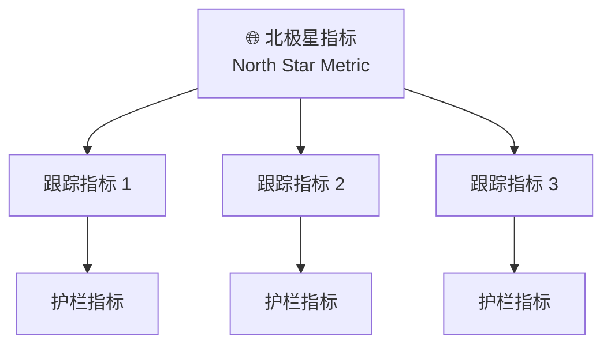

| 类型 | 作用 | 示例 | 频次 |
|------|------|------|------|
| **北极星指标** | 衡量用户价值的核心 | "周活跃分析会话数" | 每周追踪 |
| **跟踪指标** | 关键漏斗和健康度 | "自然语言→图表的成功率"、"P95 延迟" | 实时/每日 |
| **护栏指标** | 不能牺牲的底线 | "错误率 ≤ 0.5%"、"PII 泄露事件 = 0" | 实时告警 |

### 7.2 好指标的五个标准

1. **可测量** — 数据可采集，口径清晰
2. **可归因** — 指标变化可以关联到产品改动
3. **可及时** — 能实时或准实时获取（不能等一个月才知道出问题）
4. **不易作弊** — 符合 Goodhart's Law："当一个指标成为目标，它就不再是好指标"
5. **对用户有价值** — 不是虚荣指标（如"注册用户数"对活跃度毫无意义）

### 7.3 指标树（Metric Tree）

从北极星指标向下拆解：

```
北极星指标：周活跃分析会话数
  ├── 新用户激活率
  │     ├── 首次图表生成成功率
  │     └── 从登录到第一张图的时间
  ├── 老用户留存率
  │     ├── 周分析会话频率
  │     └── 多轮连续追问比例
  └── 护栏
        ├── AI 生成错误率 ≤ 1%
        ├── API P95 延迟 ≤ 3s
        └── 用户满意度 ≥ 4.2/5
```

### 7.4 HEART 框架（Google）

适用于用户体验度量：

| 维度 | 含义 | 典型指标 |
|------|------|---------|
| **H**appiness | 用户满意度 | NPS、CSAT、SUS 可用性量表 |
| **E**ngagement | 参与深度 | 每会话分析步骤数、功能使用频次 |
| **A**doption | 新用户采用 | 激活率、首次关键行为完成率 |
| **R**etention | 留存 | 周活/月活、回访率 |
| **T**ask Success | 任务完成 | 任务完成率、完成时间、错误率 |

### 7.5 指标设计反模式

| 反模式 | 表现 | 危害 |
|--------|------|------|
| **虚荣指标** | 只盯"注册数"不看"活跃数" | 增长掩盖留存危机 |
| **代理指标陷阱** | 用"AI 调用次数"衡量"AI 价值" | 优化了调用量，劣化了用户体验 |
| **单一指标** | 只盯一个数字 | 按下葫芦浮起瓢 |
| **无护栏** | 功能上线后无负面监控 | 增长 20% 但错误率暴涨 500% |

---

## 八、需求优先级排序

### 8.1 MoSCoW 方法

适用于**版本范围界定**：

| 分类 | 含义 | 判断标准 |
|------|------|---------|
| **M**ust have | 必须有 | 没有它产品不成立 |
| **S**hould have | 应该有 | 重要但可用 workaround 替代 |
| **C**ould have | 可以有 | 锦上添花 |
| **W**on't have | 本期不做 | 明确排除，记录理由 |

> Must have ≤ 总需求的 60%。超过说明范围未收敛。

### 8.2 RICE 打分模型

```
RICE Score = (Reach × Impact × Confidence) / Effort
```

| 因素 | 量化方式 | 注意 |
|------|---------|------|
| **R**each | 用户数/季度 | 0→1 产品或用户数 < 100 时失效 |
| **I**mpact | 3=巨大, 2=高, 1=中, 0.5=低, 0.25=微小 | |
| **C**onfidence | 100%=数据支撑, 80%=中等, 50%=直觉 | 低置信度 = 优先做实验 |
| **E**ffort | 人·月（含工程、设计、PM） | |

**适用边界**：RICE 适用于有一定用户基数（通常 >100）的产品。早期产品可用 **ICE**（Impact, Confidence, Ease）替代，去掉 Reach 维度。

**分数接近时**（如 1200 vs 1150），不要只看数字——拉回用户价值和战略对齐做人工判断。

### 8.3 Kano 模型


| 类型 | 满足时 | 不满足时 | 策略 |
|------|--------|---------|------|
| **基本型** | 用户无感 | 极度不满 | 必须做，但不必过度投入 |
| **期望型** | 满意度线性增长 | 不满 | 持续优化 |
| **兴奋型** | 超出预期 | 用户无感 | 差异化来源，**随时间退化为基本型** |

> Kano 分类**随时间衰减**——今天的 Delighter 是明天的 Performance、后天的 Must-be。建议每 6-12 个月重做一次 Kano 调查。

### 8.4 组合使用


补充场景：**战略需求、紧急线上问题、技术债务**不要硬套 RICE 打分——它们走独立评估通道（影响面 + 紧迫度 + 不修复的代价），但与常规需求的资源分配比例应有上限（如不超过 30%）。

---

## 九、PRD 与 Proposal

### 9.1 PRD 结构（11 字段）

| # | 章节 | 回答的问题 |
|---|------|-----------|
| 1 | **执行摘要** | 什么问题，什么方案，怎么衡量成功 |
| 2 | **背景与上下文** | 为什么现在做？不做会怎样？战略对齐（关联哪个 OKR） |
| 3 | **目标与成功指标** | 业务目标 + 用户目标 + 可量化指标（SMART） |
| 4 | **目标用户与画像** | 为谁做？他们的 JTBD 是什么？ |
| 5 | **用户故事与用例** | 核心流程 + 异常路径 + 边界情况 |
| 6 | **功能与非功能需求** | 做什么 + 性能/安全/可访问性约束 |
| 7 | **埋点规划** | 哪些行为需要追踪？事件定义和数据口径 |
| 8 | **明确不做** | 本期边界——同等重要 |
| 9 | **设计与交互** | 原型链接 + 关键交互决策及理由 |
| 10 | **技术考量** | 架构影响、依赖、数据模型变化 |
| 11 | **假设清单与风险** | 隐藏信念显式化 + 风险 owner + 缓解方案 |

### 9.2 PRD 评审 Checklist

提交评审前，逐条自检：

- [ ] 读者能否在 30 秒内理解"做什么、为谁做、为什么"？
- [ ] 是否列出了 ≥ 3 个被评估过且明确拒绝的方案及理由？
- [ ] 是否明确写了"本期不做"清单？
- [ ] 验收标准是否具体到可用自动化测试验证？
- [ ] 是否包含埋点规划和成功指标的上限/下限阈值？
- [ ] 风险清单是否标注了 owner 和缓解方案？
- [ ] 异常状态是否已设计（空状态、错误态、加载态、失败重试）？

### 9.3 Proposal 的 8 个必填字段

对于聚焦单一设计点的提案（而非整产品 PRD）：

| 字段 | 说明 |
|------|------|
| 动机 / 用户故事 | 哪些真实场景触发了它？ |
| 目标用户 | 为谁而做 |
| 现有做法及其不足 | 用户当前如何解决？痛点在哪？ |
| **本期范围与明确不做** | 做什么 + 不做什么 |
| **关键决策与依据** | 有哪几种做法？选择哪个？为什么？ |
| 基本概念与信息结构 | 核心概念与数据组织 |
| 原型 / Demo | 有界面附原型，无界面免填 |
| 验收标准 | 以具体例子表达，可据此验证 |

### 9.4 撰写原则

- **以例子定义行为**——"现状 / 提案后的形态 / 边界与非法情况"比抽象描述更有效
- **详略随影响面**——小改动短提案，大改动展开边界与备选方案
- **一次一个增量**——一份 Proposal 只确定一个设计点
- **假设清单**——把所有隐藏信念显式化（呼应持续发现习惯 3）

---

## 十、验证与实验

### 10.1 验证的三环模型

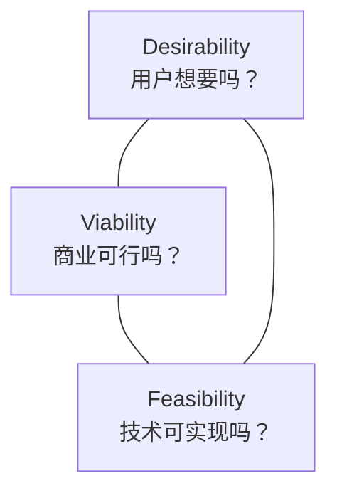

| 环 | 关键问题 | 验证手段 |
|----|---------|---------|
| **Desirability** | 用户是否需要？ | 访谈、原型测试、A/B |
| **Viability** | 商业上可行吗？ | 商业模式画布、定价测试、ROI 测算 |
| **Feasibility** | 技术上可实现吗？ | 技术 Spike、PoC、架构评审 |

### 10.2 实验阶梯

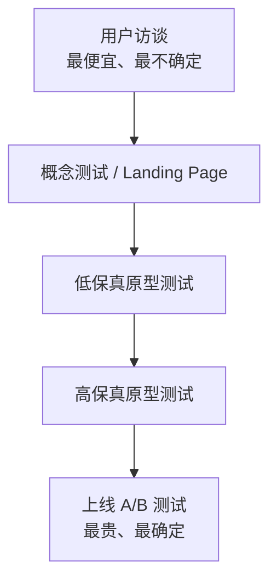

**原则**：先排"假设的风险 × 不确定性"矩阵，高风险高不确定性的优先验证；再选最便宜的实验手段。

### 10.3 实验卡片模板

```
实验名称：[一句话]
假设：我们相信 [做什么] 会带来 [什么变化]
验证方法：[访谈 / A/B / 原型测试 / 数据埋点]
样本量 / 数据量：[n ≥ ?]
成功阈值：[指标达到多少算通过]
决策标准：[通过 → 推进 / 不通过 → 放弃或转向]
时间盒：[最长实验周期]
```

### 10.4 MVP 设计原则

MVP 不是"功能最少的版本"，而是**用最少投入验证最大风险假设的版本**：

- **明确要验证的假设**——不是"用户是否需要这个产品"，而是"用户在这个特定场景下是否会执行这个关键行为"
- **定位核心动作**——MVP 只需支持一个从进入到完成核心任务的**最小闭环**
- **不追求完整性**——缺失功能可以手动补位（如"MVP 不自动分享，用户可手动复制链接"）；错误的方向无法用完整性弥补
- **MVP 与实验阶梯的衔接**：MVP 是实验阶梯中某一层的高保真形态

---

## 十一、决策与评审机制

> 方法论讲了"产出什么"，本章讲"谁拍板、什么时候拍、争议怎么解决"。这是方法落到团队中最容易卡壳的环节。

### 11.1 关键决策点

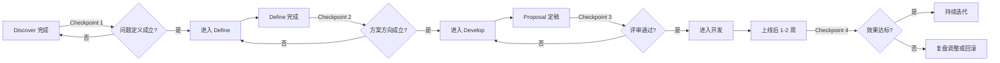

### 11.2 每个阶段的评审角色

采用 **RACI 简化版**（R=负责执行, A=最终拍板, I=需被告知）：

| 决策点 | R（谁准备） | A（谁拍板） | I（告知谁） |
|--------|-----------|-----------|------------|
| 问题定义通过 | PM | 产品负责人 | 全团队 |
| 方案方向通过 | PM + 设计师 | 产品负责人 + Tech Lead | 全团队 |
| Proposal 通过 | PM | Tech Lead + 产品负责人 | 相关干系人 |
| 效果达标判定 | PM + 数据 | 产品负责人 | 管理层（如影响大） |

### 11.3 需求变更管理

1. **变更提出**：Issue / 文档中陈述变更内容 + 原因 + 影响范围
2. **影响评估**：范围（哪些模块）、成本（人力/时间）、进度、风险
3. **审批**：由原 Proposal 的 A 角色批准或驳回
4. **同步**：变更定稿后新增文档（不覆盖旧文档），告知全团队

### 11.4 争议解决

当团队在方案上出现分歧时，按以下顺序裁决：

1. **用户证据** — 有用户数据吗？谁的用户证据更强？
2. **成功指标** — 哪个方案更直接贡献于 Outcome？
3. **约束条件** — 技术成本、时间、风险是否排除某个方案？
4. **最终拍板人** — 以上都无法裁决时，由该决策点的 A 角色做出判断，其余人 commit。

---

## 十二、AI 产品设计

> AI 产品与传统软件的本质差异：输出不确定、行为非确定、用户心智模型需重构、成本结构不同。仅套用传统方法不足以覆盖。

### 12.1 AI 产品设计四原则

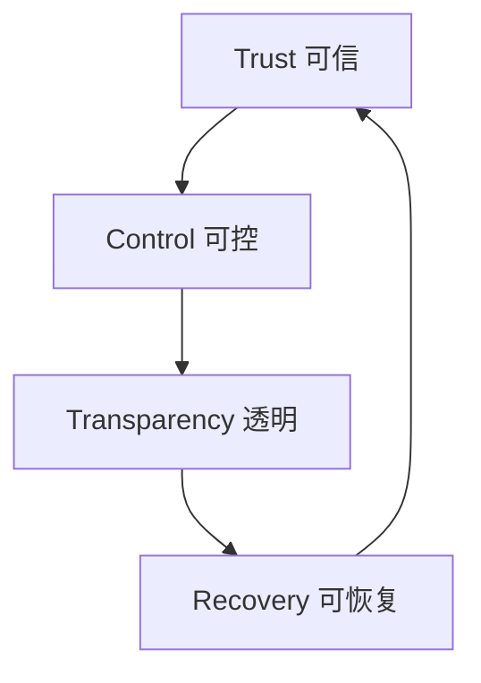

| 原则 | 含义 | 落地手段 |
|------|------|---------|
| **可信**（Trust） | 用户信任 AI 的输出 | 置信度标记、来源引用、确定性检查优先于 AI 判断 |
| **可控**（Control） | 用户始终握有最终决定权 | 高风险操作需确认、可随时退出 AI 模式 |
| **透明**（Transparency） | 用户理解 AI 在做什么、为什么 | 解释性预览、步骤可视化、不确定性标注 |
| **可恢复**（Recovery） | AI 出错后用户可以无损回退 | Undo、History、Version、Checkpoint、功能降级 |

### 12.2 AI 交互设计链路

```
Signals → Intent → Confidence → Condition Logic → AI Level → Pattern → UI
```

| 环节 | 核心问题 | 示例 |
|------|---------|------|
| **Signal** | 用户输入了什么？ | 自然语言、点击、上下文 |
| **Intent** | 系统理解用户想做什么？ | 意图识别 → "查询指标" vs "创建图表" |
| **Confidence** | AI 对结果有多确定？ | 置信度 95%（高）/ 60%（低） |
| **Condition** | 基于置信度和风险，该怎么做？ | 高置信低风险 → 直接展示；低置信高风险 → 拒绝并追问 |
| **AI Level** | AI 的自治程度？ | L1 辅助建议 → L4 自主执行（需确认） |
| **Pattern** | 用什么交互模式？ | 渐进披露、候选对比、歧义澄清 |
| **UI** | 界面怎么呈现？ | 聊天面板 + 工作台 + 确认对话框 |

### 12.3 置信度驱动的交互策略

**置信度来源**（必须先确定来源，否则"置信度决定交互"是空中楼阁）：

| 来源 | 说明 | 适用场景 |
|------|------|---------|
| **模型自报** | logprob / self-consistency / perplexity | 通用基础置信度 |
| **规则校验** | 语法检查、Schema 校验、数据新鲜度 | 确定性场景（如 PromQL 语法） |
| **用户行为反馈** | 采纳/修改/拒绝的信号回流校准 | 持续优化，非实时 |

**交互矩阵**：

| 置信度 | 风险 | 交互模式 | 示例 |
|--------|------|---------|------|
| 高 | 低 | 直接展示，允许一键撤销 | AI 自动补全时间范围 |
| 高 | 高 | 展示 + 突出变更 + 需确认 | AI 生成 Dashboard 并准备写回 |
| 低 | 低 | 展示候选列表，用户选择 | AI 不确定指标名，给出 3 个候选 |
| 低 | 高 | 不执行，要求用户提供更多信息 | AI 不能确定用户想操作哪个数据源 |

### 12.4 AI 交互模式库（13 种）

| 模式 | 描述 | 典型场景 |
|------|------|---------|
| **渐进披露** | 先展示摘要，用户点击展开 | 多步分析结果 |
| **歧义澄清** | AI 识别歧义时主动回问 | 指标名模糊 |
| **解释性预览** | 执行前展示即将做什么 | 生成的查询预览 |
| **候选方案对比** | 展示多个方案让用户选择 | 图表配置候选 |
| **内联编辑** | 用户可直接修改 AI 生成内容 | 修改查询或配置 |
| **差异高亮** | 突出 AI 变更 vs 修改前 | Patch 预览 |
| **置信度标记** | 低置信度输出标记颜色/图标 | 语义匹配不明确 |
| **撤销回退** | 一键回到操作前状态 | 图表编辑 |
| **反馈嵌入** | 输出旁放置反馈按钮 | 收集满意度 |
| **逐步引导** | 分多步引导完善输入 | 补充时间范围、服务名 |
| **智能默认** | AI 填充合理默认值 | 自动选最近时间范围 |
| **上下文关联** | 保持多轮对话上下文 | 连续追问 |
| **主动中断** | AI 检测到用户可能走偏时主动暂停 | 输入不足、范围过大时建议澄清 |

### 12.5 评测体系（Eval）

评测分两层，缺一不可：

#### 离线评测（发版前）

| 评测层 | 方法 | 频次 |
|--------|------|------|
| **确定性检查** | 格式校验、Schema 约束、语法检查 | 每次变更 |
| **统计指标** | 准确率、召回率、幻觉率、延迟分布 | 每次变更 |
| **LLM-as-Judge** | 语义相关性、回复完整性、语调 | 关键变更 |
| **Golden Dataset** | 专家标注标准问答对，回归测试 | 每周 + 发版前 |

**Golden Dataset 维护**：
- 初始 ≥ 50 条覆盖核心场景的问答对
- 每发现一个 Bad Case，标注后加入 Golden Dataset
- 发版前必须全量回归

#### 在线评测（上线后）

| 指标 | 含义 | 预警阈值 |
|------|------|---------|
| **采纳率** | 用户直接使用 AI 输出的比例 | < 60% |
| **主动修改率** | 用户修改 AI 输出后才使用的比例 | > 30% |
| **重新生成率** | 用户点"重新生成"的比例 | > 20% |
| **拒绝率** | 用户看到输出后放弃的比例 | > 15% |

### 12.6 安全护栏（Guardrails）

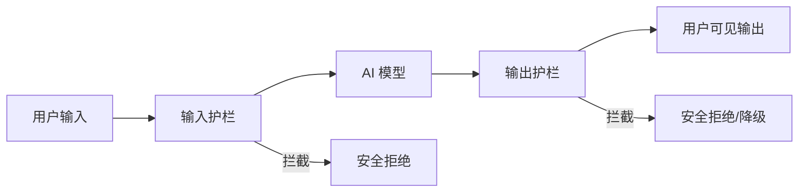

| 护栏类型 | 拦截内容 | 处理方式 |
|---------|---------|---------|
| **输入护栏** | Prompt Injection、越狱尝试、PII 泄露 | 拒绝请求 + 通用回复 |
| **输出护栏** | 幻觉内容、越权操作、有害内容、合规违规 | 降级到安全回复 / 转人工 |
| **行为护栏** | 超范围操作、高频调用 | 限流 + 确认 |

### 12.7 失败模式与降级策略

| 失败模式 | 表现 | 降级策略 |
|---------|------|---------|
| **幻觉** | 输出看似合理但实际错误 | 置信度标记 + 来源引用 + 一键校验 |
| **歧义误解** | 对用户意图识别错误 | 主动回问澄清 + 候选列表 |
| **超范围行为** | AI 执行了不该执行的操作 | 行为护栏拦截 + 重新授权 |
| **过度自信** | 低置信度但未标记 | 规则校验兜底 + 最低置信度阈值 |
| **超时/无响应** | 模型调用超时 | 流式输出 + timeout 后降级到简化回复 |
| **成本爆炸** | 长对话 token 累积 | token 预算上限 + 上下文窗口管理 |

### 12.8 成本与性能设计

AI 产品特有的设计约束：

- **按场景选模型**：高风险场景用大模型（贵但准），高频低风险用小模型（快且便宜）
- **Token 预算**：单次会话 token 上限，超限后自动压缩历史或提示用户
- **P95 延迟 SLO**：定义可接受的响应时间上限，超时降级
- **流式输出**：缓解长响应的感知延迟
- **缓存策略**：对相似请求缓存结果，减少重复推理

### 12.9 反馈飞轮

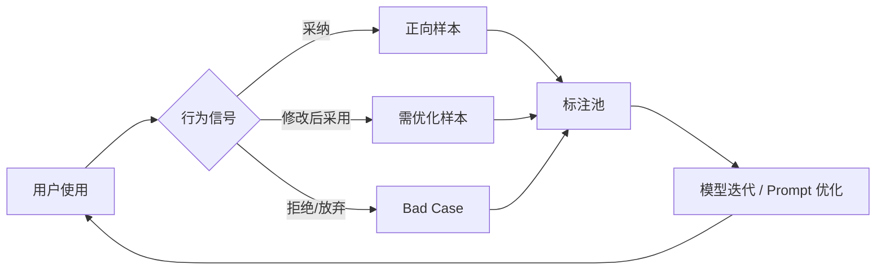

用户每一次对 AI 输出的采纳、修改或拒绝都是标注信号。产品设计应默认采集这些信号（需脱敏），形成持续优化的闭环。

---

## 十三、反模式：十大失败模式

> 人更容易记住"不要做什么"。以下反模式按严重程度排序。

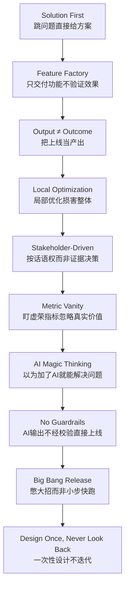

### 详解

**1. Solution First（方案先行）**
直接跳到"做什么功能"，没有先定义问题。PM 的第一反应不是"用户遇到了什么困难"，而是"我们可以加个 XX 功能"。→ 先写 Problem Statement，写完前不讨论方案。

**2. Feature Factory（功能工厂）**
持续交付功能但不验证效果。团队的衡量标准是"上线了多少功能"而非"解决了什么问题"。→ 每个功能上线后 1-2 周强制复盘。

**3. Output ≠ Outcome（产出 ≠ 结果）**
把交付物当成成果。"上线了 AI 助手"是产出，"用户从意图到图表的时间减少 60%"是结果。→ 每个 Milestone 的验收标准必须是 Outcome 指标，不能是功能列表。

**4. Local Optimization（局部优化）**
优化了某个环节但整体体验变差。比如"把注册流程减少 2 步"但新用户激活率反而下降（因为缺少引导）。→ 改动前画端到端 Journey，改动后盯北极星指标。

**5. Stakeholder-Driven（干系人驱动）**
按组织内话语权最高的人的意见决策，而非按用户证据。→ 用"假设-实验-数据"替代"我觉得"。

**6. Metric Vanity（虚荣指标）**
盯"注册用户数"不看"周活跃用户数"，盯"AI 调用次数"不看"任务完成率"。→ 每个指标过一遍"五个标准"。

**7. AI Magic Thinking（AI 万能思维）**
以为加个 LLM 就能解决一切。不加 AI 可以解决的问题，加了 AI 也不会自动解决。→ AI 是手段不是目的。先问"不做 AI，这个需求怎么解决？"

**8. No Guardrails（无护栏）**
AI 输出不经校验直接展示或执行。→ AI 产品必须内建输入/输出护栏，高风险操作必须有确认步骤。

**9. Big Bang Release（憋大招）**
把 MVP 做成完整版才上线。三个月过去了还没验证核心假设。→ 用实验阶梯：两周内必须拿出一个可验证假设的最小版本。

**10. Design Once, Never Look Back（一次设计永不回看）**
OST 画完就冻结，PRD 写完不管上线效果。→ 每周更新 OST，每个 Milestone 复盘架构和产品决策。

---

## 十四、方法选择指南

### 14.1 决策树

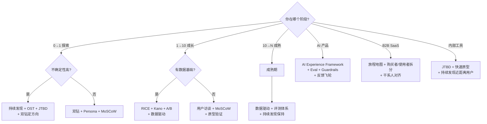

### 14.2 流程裁剪规则

并非所有项目都需要走全流程。按规模裁剪：

| 项目规模 | 必做 | 可跳过 |
|---------|------|--------|
| **大需求**（影响核心流程、跨多模块） | 完整 Proposal + OST + 三环验证 + 评审 | 无 |
| **中等需求**（单模块新增功能） | Mini Proposal + 假设清单 + 验证 | 完整 OST、Kano 调查 |
| **小优化**（文案、交互微调） | 问题陈述 + 验收标准 + 数据埋点 | Proposal、OST、评审 |
| **紧急修复**（线上问题、安全漏洞） | 影响评估 + 修复方案 + 上线验证 | 所有设计流程 |

**底线不能跳过**：所有改动都要回答问题陈述（改什么、为什么、怎么验证）。紧急修复可以事后补文档，但不能不补。

### 14.3 按产品类型选择

| 产品类型 | 侧重方法 | 特别注意 |
|---------|---------|---------|
| 开发者工具 | JTBD（高度依赖情境） | 用户技能水平是关键变量 |
| AI 产品 | AI Experience Framework + Eval | 置信度驱动 + 安全护栏 |
| B2B SaaS | 旅程地图 + 购买者/使用者拆分 | 购买者 ≠ 使用者 |
| 内部工具 | 持续发现（近距离接触用户） | 可以忍受粗糙 UI，不能接受错误决策 |
| 基础设施/API | JTBD + 技术可行性 | 界面可能只有文档和 SDK |

### 14.4 团队成熟度适配

| 团队规模 | 推荐粒度 |
|---------|---------|
| 1-3 人 | Proposal 8 字段足够，OST 可手绘/白板 |
| 3-10 人 | 完整 PRD 结构 + 假设清单 + 评审 Checklist |
| 10+ 人 | 全流程 + RACI 决策矩阵 + 干系人签字 + 变更管理 |

---

## 参考资料

| 方法论/框架 | 核心文献 | 适用环节 |
|------------|---------|---------|
| Double Diamond | British Design Council | 项目骨架 |
| Design Thinking | IDEO / Stanford d.school | 问题探索 |
| Continuous Discovery + OST | Teresa Torres, *Continuous Discovery Habits* (2021) | 持续发现 |
| JTBD | Clayton Christensen, *Competing Against Luck* | 问题定义 |
| Switch Interview | Bob Moesta | JTBD 落地访谈 |
| Outcome-Driven Innovation | Anthony Ulwick | 机会量化 |
| RICE | Sean McBride (Intercom) | 优先级排序 |
| Kano Model | Noriaki Kano | 需求分类 |
| MoSCoW | Dai Clegg (Oracle) | 版本范围 |
| INVEST | Bill Wake | 用户故事质量 |
| HEART | Google (Kerry Rodden et al.) | 体验度量 |
| SUS | John Brooke | 可用性量表 |
| Goodhart's Law | Charles Goodhart | 指标设计警惕 |
| AI Experience Framework | [GitHub - nerdwglassez/ai-experience-framework](https://github.com/nerdwglassez/ai-experience-framework) | AI 交互设计 |
| Human-Centered AI | Google PAIR | AI 产品设计 |
| Human Interface Guidelines for AI | Apple | AI 交互规范 |
| 启示录 (Inspired) | Marty Cagan | 产品管理实践 |
| 用户体验要素 | Jesse James Garrett | 设计分层 |

---

> **文档版本**：v2.0 | **更新日期**：2026-07-09
>
> 本版新增：产品设计四层模型、指标设计独立章节、决策与评审机制、AI 专篇工程化扩展（Eval/Guardrails/成本/飞轮）、十大失败模式、流程裁剪规则、PRD 评审 Checklist、实验卡片模板、Mermaid 图表体系、方法选择决策树。
